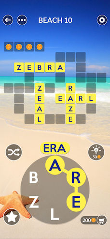

# Wordscapes Helper

A Rust/WASM app that helps you find words from scrambled letters, with optional word structure filtering.

This repository contains 5 algorithms to accomplish the former, as well as a webpage with a simple UI that uses the fastest of the contained algorithms (for most inputs).

## Running

1. Generate DAG binary from given wordlist to be embedded at compile time: `cargo run --release --bin gen_files -- small`

2. install wasm-pack: `curl https://rustwasm.github.io/wasm-pack/installer/init.sh -sSf | sh`

3. Install NPM packages: `npm install`

4. Run local server `npm run serve` OR build distribution `npm run build`

## Intro & Motivation

Wordscapes is a puzzle game in which a board (similar to a crossword puzzle) and a set of letters arranged in a circle is presented to the player. The objective is to swipe, starting at any letter, a sequence of letters that make up a word. The player can infer the number of letters in each target word, as well as the number of target words in each puzzle from the board. Words usually (but not always) intersect each other, which gives players clues about the position of certain letters in certain words.

|  | 
|:--:| 
| *Example Wordscapes board* |

## Algorithms

- DAG Searcher

- Simple Searcher

- Exponential Searcher

- Trie Searcher

- Automaton Searcher
